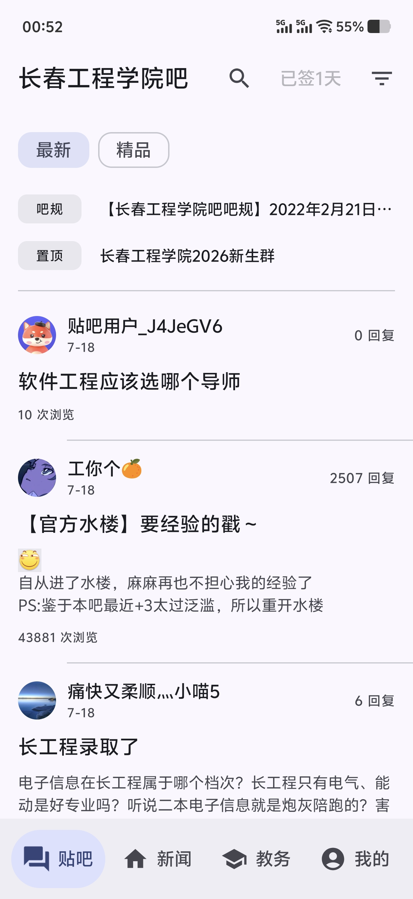
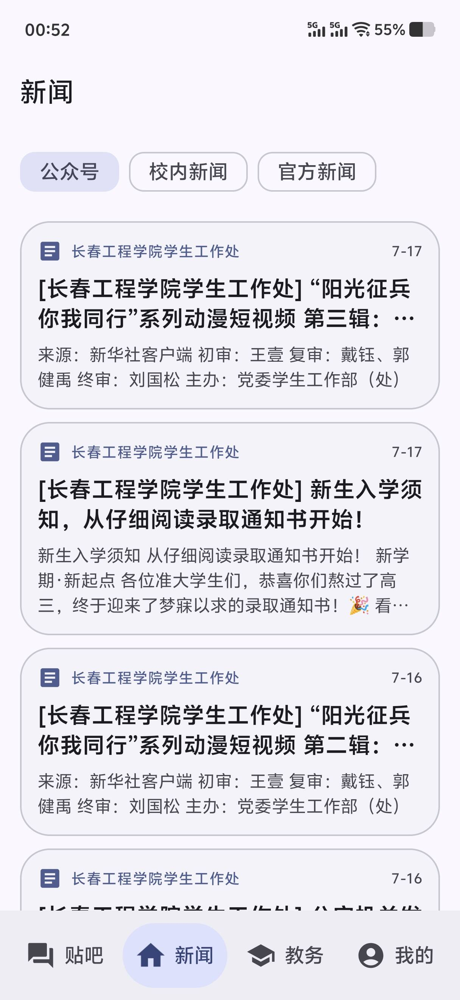
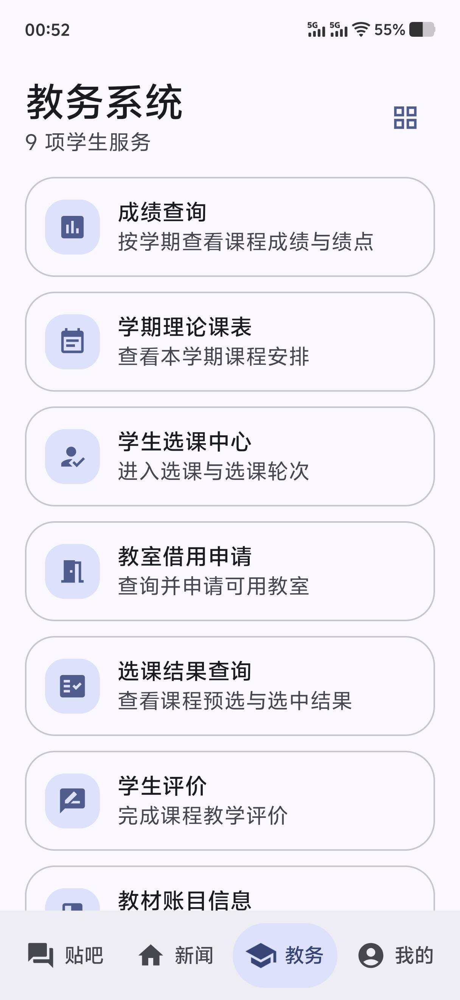

<h1 align="center">Cithub</h1>

 
 

面向长春工程学院学生的<strong>第三方 Android 平台客户端</strong>

通过学校 WebVPN 登录，更方便地在手机上查询成绩和使用校园教务功能。

## 介绍

Cithub 是一款面向长春工程学院学生的 Android 客户端。

应用通过学校 WebVPN 访问校内服务，为学生提供更加方便的移动端使用体验。目前主要支持 教务系统。

> 本项目为学生开发的第三方非官方客户端，与长春工程学院及学校相关系统的官方运营方无隶属或合作关系。

## 主要功能

* 便捷访问校内贴吧
* 便捷查看校内新闻
* 可以使用自己的rss
* 课表查询
* 成绩查询
* 便捷使用教务系统
* Material 3 原生界面

点点Star⭐，求求啦~

## 下载

* [GitHub Releases](https://github.com/aquasofts/Cithub/releases)
* [查看项目源码](https://github.com/aquasofts/Cithub)

请优先从 GitHub Releases 下载最新版本。

## 免责声明

Cithub 是第三方非官方客户端，不代表长春工程学院。

学校系统的接口、登录方式、网页结构和安全策略可能随时调整，因此本应用无法保证所有功能始终可用。

因学校系统升级、网络故障、设备环境、用户操作或第三方服务变化造成的问题，开发者不承担相应责任。

涉及选课、考试、成绩认定、学籍管理等重要事项时，请务必以学校官方通知和官方系统中的信息为准。

## 开源许可与贴吧来源

整合贴吧功能后的应用按 GNU GPL version 3 发布。贴吧登录、浏览映射与自动签到逻辑基于固定提交
[`TiebaLite@910fd56`](https://github.com/0ranko0P/TiebaLite/tree/910fd564c47f77ab6a807f1bc122279e7b9aa0b1)
修改，完整来源、版权和修改说明见 [`feature/tieba/NOTICE.md`](feature/tieba/NOTICE.md)。
